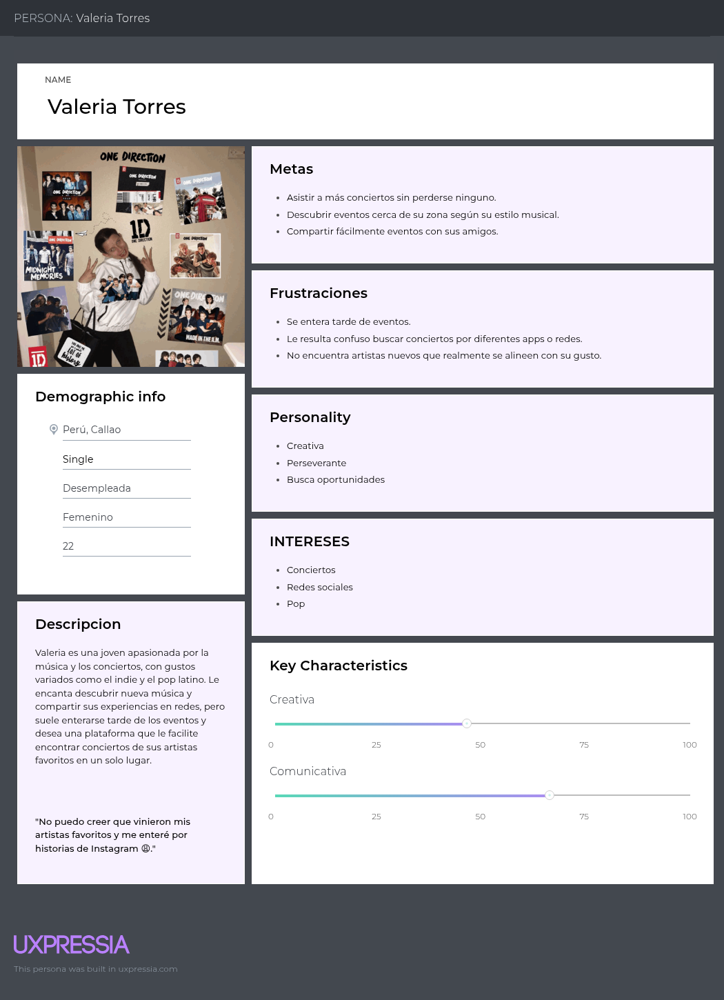
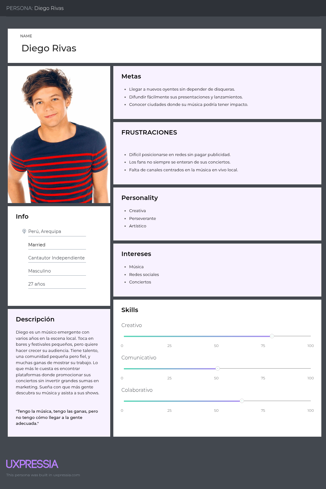
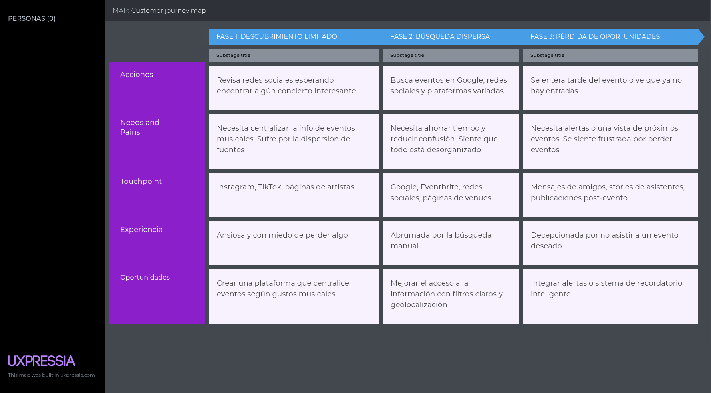

	
  
## Universidad Peruana de Ciencias Aplicadas

**1ACC0238 - Aplicaciones para Dispositivos Móviles**

Carrera de Ingeniería de Software

**NRC:** 1813

**Profesor:** Eduardo Martin Reyes Rodriguez

## Informe de TB1 

"GigMap"

**Integrantes:**

Cabanillas Meza, Jose Mateo (u202311458)

Collantes Carrillo, Diego Mateo (u202311823)

Lizarbe Alvarez, Ariana Nickole (u202311704)

Ortiz Cardenas, Johanna Antuanete (u202310358)

Zegarra Lopez, Renato Sebastian Rubber (u202311558)

**2025**

## Registro de Versiones del Informe

<table>
  <thead>
    <tr>
      <th>Versión</th>
      <th>Fecha</th>
      <th>Autor</th>
      <th>Descripción de modificación</th>
    </tr>
  </thead>
  <tbody>
    <tr>
      <td>TB1</td>
      <td>08/09/2025</td>
      <td>
  - Cabanillas Meza, Jose Mateo  
	- Collantes Carrillo, Diego Mateo  
	- Lizarbe Alvarez, Ariana Nickole  
	- Ortiz Cardenas, Johanna Antuanete  
	- Zegarra Lopez, Renato Sebastian Rubber   
      </td>
      <td> </td>
    </tr>
  </tbody>
</table>

# Project Report Collaboration Insights

## **Contenido**
- [STUDENT OUTCOME](#student-outcome)
- [Project Report Collaboration Insights](#project-report-collaboration-insights)

- [CAPÍTULO I: Presentación](#capítulo-i-presentación)
- [1.1. Startup Profile](#11-startup-profile)
    - [1.1.1. Descripción de la Startup](#111-descripción-de-la-startup)
    - [1.1.2. Perfiles de integrantes del equipo](#112-perfiles-de-integrantes-del-equipo)
  - [1.2. Solution Profile](#12-solution-profile)
    - [1.2.1. Antecedentes y problemática](#121-antecedentes-y-problemática)
    - [1.2.2. Lean UX Process](#122-lean-ux-process)
      - [1.2.2.1. Lean UX Problem Statements](#1221-lean-ux-problem-statements)
      - [1.2.2.2. Lean UX Assumptions](#1222-lean-ux-assumptions)
      - [1.2.2.3. Lean UX Hypothesis Statements](#1223-lean-ux-hypothesis-statements)
      - [1.2.2.4. Lean UX Canvas](#1224-lean-ux-canvas)
  - [1.3. Segmentos objetivo](#13-segmentos-objetivo)
    
 - [Capítulo II: Requirements Elicitation & Analysis](#capítulo-ii-requirements-elicitation--analysis)
  - [2.1. Competidores](#21-competidores)
    - [2.1.1. Análisis competitivo](#211-análisis-competitivo)
    - [2.1.2. Estrategias y tácticas frente a competidores](#212-estrategias-y-tácticas-frente-a-competidores)
  - [2.2. Entrevistas](#22-entrevistas)
    - [2.2.1. Diseño de entrevistas](#221-diseño-de-entrevistas)
    - [2.2.2. Registro de entrevistas](#222-registro-de-entrevistas)
    - [2.2.3. Análisis de entrevistas](#223-análisis-de-entrevistas)
  - [2.3. Needfinding](#23-needfinding)
    - [2.3.1. User Personas](#231-user-personas)
    - [2.3.2. User Task Matrix](#232-user-task-matrix)
    - [2.3.3. User Journey Mapping](#233-user-journey-mapping)
    - [2.3.4. Empathy Mapping](#234-empathy-mapping)
    - [2.3.5 Ubiquitous Language](#235-ubiquitous-language)
  - [2.4: Requirements Specification](#24-requirements-specification)
    - [2.4.1 User Stories](#241-user-stories)
    - [2.4.2 Impact Mapping](#242-impact-mapping)
    - [2.4.3 Product Backlog](#243-product-backlog)
  - [2.5. Strategic-Level Domain-Driven Design](#25-strategic-level-domain-driven-design)
    - [2.5.1. EventStorming](#251-eventstorming)
      - [2.5.1.1. Candidate Context Discovery](#2511-candidate-context-discovery)
      - [2.5.1.2. Domain Message Flows Modeling](#2512-domain-message-flows-modeling)
      - [2.5.1.3. Bounded Context Canvases](#2513-bounded-context-canvases)
    - [2.5.2. Context Mapping](#252-context-mapping)
    - [2.5.3. Software Architecture](#253-software-architecture)
      - [2.5.3.1. Software Architecture Context Level Diagrams](#2531-software-architecture-context-level-diagrams)
      - [2.5.3.2. Software Architecture Container Level Diagrams](#2532-software-architecture-container-level-diagrams)
      - [2.5.3.3. Software Architecture Deployment Diagrams](#2533-software-architecture-deployment-diagrams)
  - [2.6. Tactical-Level Domain-Driven Design](#26-tactical-level-domain-driven-design)
    - [2.6.X. Bounded Context: <Bounded Context Name>](#26x-bounded-context-bounded-context-name)
      - [2.6.X.1. Domain Layer](#26x1-domain-layer)
      - [2.6.X.2. Interface Layer](#26x2-interface-layer)
      - [2.6.X.3. Application Layer](#26x3-application-layer)
      - [2.6.X.4. Infrastructure Layer](#26x4-infrastructure-layer)
      - [2.6.X.5. Bounded Context Software Architecture Component Level Diagrams](#26x5-bounded-context-software-architecture-component-level-diagrams)
      - [2.6.X.6. Bounded Context Software Architecture Code Level Diagrams](#26x6-bounded-context-software-architecture-code-level-diagrams)
      - [2.6.X.6.1. Bounded Context Domain Layer Class Diagrams](#26x61-bounded-context-domain-layer-class-diagrams)
      - [2.6.X.6.2. Bounded Context Database Design Diagram](#26x62-bounded-context-database-design-diagram)
      
- [Conclusiones](#conclusiones)
- [Conclusiones y recomendaciones](#conclusiones-y-recomendaciones)
- [Bibliografía](#bibliografía)
- [Anexos](#anexos)

## STUDENT OUTCOME

ABET 7 - EAC - Student Outcome 7: La capacidad de adquirir y aplicar nuevos conocimientos según sea necesario, utilizando estrategias de aprendizaje apropiadas.

<table border="1">
  <thead>
    <tr>
      <th>Criterio específico</th>
      <th>Acciones realizadas</th>
      <th>Conclusiones</th>
    </tr>
  </thead>
  <tbody>
    <tr>
      <td>7.c1. Actualiza conceptos y
conocimientos necesarios para su
desarrollo profesional y en especial para
su proyecto en soluciones de ingeniería
de software</td>
      <td>
        <strong>Cabanillas Meza, Jose Mateo</strong> 
        TB1:  
	       
        <strong>Collantes Carrillo, Diego Mateo</strong> 
        TB1:  
	       
        <strong>Lizarbe Alvarez, Ariana Nickole</strong> 
        TB1:   
	      	       
        <strong>Ortiz Cardenas, Johanna Antuanete</strong> 
        TB1:   
        <strong>Zegarra Lopez, Renato Sebastian Rubber</strong> 
        TB1:  
      </td>
      <td>
        conclusiones
      </td>
    </tr>
    <tr>
      <td>7.c2. Reconoce la necesidad del
aprendizaje permanente para el
desempeño profesional y el desarrollo
de proyectos en soluciones de
tecnologías de ingeniería de software.</td>
      <td>
        <strong>Cabanillas Meza, Jose Mateo</strong> 
        TB1:  
	       
        <strong>Collantes Carrillo, Diego Mateo</strong> 
        TB1:  
         
        <strong>Lizarbe Alvarez, Ariana Nickole</strong> 
	       TB1: 
  
        <strong>Ortiz Cardenas, Johanna Antuanete</strong> 
        TB1:  
	       
        <strong>Zegarra Lopez, Renato Sebastian Rubber</strong> 
        TB1:  
	       
        </td>
      <td>
        conclusiones
      </td>
    </tr>
  </tbody>
</table>

## Objetivos SMART

# CAPÍTULO I: Presentación

# 1.1. Startup Profile

## 1.1.1. Descripción de la Startup
StayBits es una startup creativa y tecnológica dedicada a transformar la manera en que las personas descubren, conectan y disfrutan la música en vivo, convencidos de que cada concierto, sin importar su escala, tiene la capacidad de despertar emociones únicas y generar lazos duraderos entre artistas y fans. Nuestro esfuerzo se centra en GigMap, una aplicación mobile interactiva que funciona como un puente entre los amantes de la música y los escenarios de su ciudad, ofreciendo un mapa dinámico con geolocalización donde los usuarios pueden explorar eventos en tiempo real, seguir a sus artistas preferidos, conocer las fechas de sus giras, registrar su asistencia en conciertos y compartir experiencias con otros fans. Además, proporcionamos herramientas de visibilidad y promoción para bandas emergentes, impulsando así el crecimiento de la escena musical independiente. En StayBits creemos en el poder de la comunidad, el descubrimiento espontáneo y la tecnología como motores para enriquecer la vida cultural, con la visión de crear una red global en la que cada presentación en vivo "desde un pequeño bar hasta un gran festival internacional" pueda ser encontrada, compartida y disfrutada al máximo, celebrando la diversidad y el dinamismo del mundo musical. Con pasión, innovación y compromiso social, desde el corazón de StayBits impulsamos proyectos como GigMap, que reinventan la manera de vivir la música en directo y la acercan a quienes más la disfrutan.

## 1.1.2. Perfiles de integrantes del equipo
| Estudiante | Descripción |
|------------|-------------|
|  **Cabanillas Meza, José Mateo (u202311458)** | Mi nombre es Mateo Cabanillas y en la actualidad estoy cursando el sexto ciclo de la carrera de ingeniería de software en la universidad peruana de ciencias aplicadas, con una mente creativa y una actitud colaborativa. Mi amor por la programación y la resolución de problemas me impulsa a explorar nuevas soluciones y aportar ideas frescas a los proyectos. Como compañero de equipo, soy amable, atento y siempre estoy dispuesto a ayudar. Creo firmemente en la importancia de la comunicación efectiva y la colaboración para lograr resultados excepcionales. |
|  **Collantes Carrillo, Diego Mateo (u202311823)** | Mi nombre es Diego Collantes. Tengo 19 años. Soy estudiante de sexto ciclo en la Universidad Peruana de Ciencias Aplicadas (UPC). Disfruto de leer, redactar y escuchar música en mi tiempo libre. Elegí esta carrera, ya que me interesó todo el proceso que hay detrás de cada aplicación o programa que usamos en nuestro día a día. Personalmente, espero ampliar mis conocimientos en este ámbito a lo largo de este curso. Además, estoy comprometido a contribuir en todo lo que sea posible con el equipo y a desempeñarme de manera adecuada. |
|  **Lizarbe Alvarez, Ariana Nickole (u202311704)** | Mi nombre es Ariana Lizarbe, tengo 20 años y estoy cursando el sexto ciclo de la carrera de ingeniería de software en la Universidad Peruana de Ciencias Aplicadas. En mi tiempo libre fuera de la universidad, procuro mejorar mis habilidades blandas, como la empatía o inteligencia emocional. También, me esfuerzo en adquirir conocimientos que pueden ayudarme a desarrollarme como futura profesional, como distintos lenguajes de programación. A su vez, disfruto de escuchar música, podcasts, leer y ver series de televisión. Me comprometo a colaborar de manera activa y responsable en la creación de esta startup, aportando mis habilidades en pensamiento crítico, trabajo en equipo y adaptabilidad para alcanzar un trabajo de calidad sobresaliente. |
|  **Ortiz Cardenas, Johanna Antuanete (u202310358)** | Mi nombre es Johanna Antuanete Ortiz Cárdenas, tengo 19 años y me encuentro en el sexto ciclo de la carrera de Ingeniería de Software. Me considero una persona proactiva y responsable, siempre buscando que mis trabajos sean de la mejor calidad posible. Me apasiona investigar sobre tecnología, lo que me permite estar al tanto de las últimas novedades y tendencias. En mi tiempo libre, disfruto jugar videojuegos, escuchar música y leer cómics. En el presente proyecto grupal, me comprometo a colaborar de manera activa, aportando ideas y siendo puntual con los entregables para garantizar resultados sobresalientes. |
|  **Zegarra Lopez, Renato Sebastian Rubber (u202311558)** | Mi nombre es Renato Zegarra, tengo 19 años y actualmente estoy cursando la carrera de Ingeniería de Software en la Universidad Peruana de Ciencias Aplicadas. Fuera de mis estudios, disfruto explorar mis intereses en música, videojuegos y tecnología, siempre buscando nuevas formas de integrar estas pasiones en mi vida cotidiana. Me comprometo a colaborar de manera activa y responsable en la elaboración de este documento y en la concreción de la idea propuesta, aportando mis habilidades en análisis, creatividad y adaptabilidad. Estoy convencido de que con esfuerzo y trabajo en equipo, podemos alcanzar resultados innovadores y de alta calidad. |

# 1.2 Solution Profile
## 1.2.1. Antecedentes y problemática

**What**:

Las personas experimentan dificultad para descubrir y encontrar conciertos en vivo, en especial aquellos no tan conocidos. Esto reduce la visibilidad de artistas emergentes, limita el acceso a experiencias musicales auténticas y debilita el impacto de la música local en la rutina de los fans.
Por ejemplo, Chartmetric (2023) reporta que el 99,9 % de los artistas añadidos a la plataforma ese año permanecieron en las categorías de "no descubiertos" o "en desarrollo", mientras solo el 0,1 % alcanzó niveles medios o de éxito, destacando la extrema saturación de talento y la falta de visibilidad

**When**:

Esta problemática surge especialmente justo cuando las personas están dispuestas a disfrutar de música en vivo pero no tienen acceso a información confiable en tiempo real. Este escenario ocurre con frecuencia durante salidas espontáneas en fin de semana, cuando los fans intentan seguir a artistas emergentes pero desconocen sus fechas locales, y también en el caso de turistas que desean explorar la vida cultural de nuevas ciudades sin herramientas adecuadas de difusión. La evidencia de comportamiento en la recopilacion de Google (2016) sobre búsquedas locales que indica que el 76% de quienes buscan “algo cerca” en su smartphone visitan un lugar relacionado en 24 horas, subrayando la relevancia de la inmediatez móvil.

**Where**:

Ocurre en diversos entornos:
	- En la rutina diaria de los usuarios
 	- Al viajar o buscar actividades fuera de la zona habitual
  	- En barrios con oferta musical pero escasa visibilidad digital
	- En ciudades donde los medios tradicionales no alcanzan al público digital o joven
 
 La UNESCO (2022) advierte que los marcos e infraestructuras digitales son claves para ampliar el acceso y la participación cultural.
 

**Why**:

Porque asistir a conciertos en vivo genera valor cultural, emocional y social. No solo fortalece el sentido de comunidad y apoya directamente a los artistas, sino que también fomenta el descubrimiento de propuestas novedosas. La ausencia de una herramienta eficaz que conecte al público con eventos locales, especialmente independientes o espontáneos, impide el acceso a experiencias significativas y perjudica tanto a los músicos como al público.

**Who**:

Las personas más afectadas son:
	- Fans de música en vivo, tanto jóvenes como adultos, que buscan conciertos interesantes cerca de su ubicación pero carecen de información centralizada y actualizada.
	- Artistas emergentes y bandas independientes, que enfrentan enormes barreras para lograr visibilidad y difusión en un entorno competitivo.
 
La literatura sobre industrias culturales documenta desigualdades estructurales que dificultan a los independientes alcanzar audiencias sin mediación tecnológica (Hesmondhalgh, 2019).

**How**:

GigMap resuelve esta necesidad mediante una aplicación móvil que centraliza, personaliza y geolocaliza información sobre conciertos en tiempo real. La tecnología se apoya en: preferencias del usuario, ubicación, filtros de género, fechas y tipo de evento, alertas personalizadas, acceso a shows independientes, y funciones de recomendación y compartición social. Integra múltiples fuentes (publicaciones de artistas, registros de eventos, recomendaciones sociales) para ofrecer una experiencia fluida, espontánea y enriquecedora.

**How much:**

Si no se interviene:
	- Artistas pierden oportunidades para darse a conocer, generar ingresos y construir una base de seguidores.
	- La asistencia a conciertos disminuye, afectando la economía de espacios culturales, bares y promotores locales.
	- La vida cultural urbana se empobrece al invisibilizar propuestas valiosas.
	- Hay frustración entre los fans que desean experiencias auténticas y no encuentran cómo acceder a ellas.

En cambio, una solución como GigMap tiene un alto potencial de impacto positivo, ya que puede fomentar la cultura local, promover el descubrimiento musical y apoyar el ecosistema artístico independiente, directamente conectando al público con la música en vivo.

## 1.2.2. Lean UX Process
### 1.2.2.1. Lean UX Problem Statements

Nuestros usuarios son personas apasionadas por la música en vivo: jóvenes, adultos que buscan experiencias auténticas y desean conectar con la escena musical de cada ciudad. Para ellos, encontrar conciertos cercanos en tiempo real y con información adaptada a sus intereses es una necesidad real, ya que muchos eventos, sobre todo los de menor escala, pasan desapercibidos por la falta de difusión. Esta brecha provoca que el público no logre descubrir a los artistas emergentes y que la escena independiente vea limitado su alcance y crecimiento. Sabremos que hemos respondido a este desafío cuando los usuarios utilicen GigMap para asistir a más conciertos, se incremente la visibilidad de músicos independientes y exista una participación activa en funciones como la geolocalización, las alertas personalizadas y la exploración de eventos.

Por este motivo, GigMap asume el compromiso de ofrecer una aplicación accesible, intuitiva y pensada en las necesidades reales del usuario, que sirva de puente directo entre los fans y la música en vivo. A través de herramientas inteligentes de descubrimiento, personalización y notificación, GigMap busca fortalecer el vínculo entre artistas y público, impulsando una cultura musical más diversa, cercana e inclusiva. El propósito es empoderar tanto a quienes crean como a quienes disfrutan la música, construyendo una comunidad que valore, comparta y mantenga viva la experiencia única de los conciertos en directo.

### 1.2.2.2. Lean UX Assumptions

Creemos que los usuarios de GigMap son principalmente jóvenes y adultos que disfrutan de la música en vivo y valoran experiencias auténticas, tanto en su ciudad como durante sus viajes. Detectamos que estas personas enfrentan dificultades para descubrir conciertos de pequeña y mediana escala debido a la falta de canales de difusión efectivos, lo que genera una desconexión con los artistas emergentes y los hace perderse de eventos significativos. Consideramos que valorarán una aplicación móvil que les permita recibir notificaciones personalizadas, explorar conciertos cercanos en tiempo real y descubrir propuestas locales de manera sencilla y atractiva. Una solución efectiva debe ser intuitiva, basada en la geolocalización, personalizable según gustos musicales y capaz de visibilizar eventos independientes que no suelen aparecer en medios tradicionales.

**Assumptions Worksheet**

**¿Quién es el usuario?** 

- Personas que disfrutan de la música en vivo y buscan nuevas experiencias culturales.
- Artistas emergentes que desean difundir su música y conectar con la comunidad.

**¿Dónde encaja nuestro producto en su trabajo o vida?**

- GigMap funcionará como una herramienta esencial en el día a día de los usuarios, ayudándoles a tomar decisiones rápidas y seguras sobre qué conciertos asistir.
- Puede utilizarse al planificar una salida, durante un viaje o incluso en recorridos cotidianos, sirviendo como guía personalizada para descubrir experiencias musicales alineadas con su estilo de vida.
- Será un acompañante constante en el teléfono móvil, facilitando la exploración urbana y el acceso a la escena musical local.

**¿Qué problemas tiene nuestro producto?**

- Falta de información confiable y en tiempo real sobre conciertos y eventos musicales independientes.
- Dificultad para acceder a opciones culturales en zonas desconocidas o con baja difusión digital.
- Escasez de soluciones intuitivas que integren mapas, recomendaciones y experiencias personalizadas en una sola aplicación móvil.

**¿Cuándo y cómo es nuestro producto utilizado?**

- GigMap se usa cuando los usuarios quieren salir y explorar opciones musicales cercanas.
- Puede utilizarse a lo largo del día, ya sea en el trabajo, en caminatas, paseos o al organizar actividades sociales.
- Disponible en dispositivos móviles, debe ser intuitiva y accesible incluso para usuarios con poca experiencia tecnológica.

**¿Qué características son importantes?**

- Mapas interactivos que muestren eventos musicales según los géneros favoritos del usuario.
- Información en tiempo real sobre afluencia, accesibilidad y cambios en la programación de los conciertos.
- Alertas personalizadas con recordatorios y novedades relevantes.
- Recomendaciones basadas en ubicación, historial de asistencia y gustos musicales.
- Perfiles diferenciados para fans y artistas, con beneficios adaptados a cada rol.

**Objetivos**

- Facilitar el descubrimiento de conciertos: ayudar a los usuarios a encontrar eventos cercanos de manera personalizada y rápida.
- Fortalecer la conexión entre fans y artistas: generar una red activa de interacción y apoyo mutuo.
- Transformar la movilidad urbana en una experiencia cultural: vincular la exploración de la ciudad con la música en vivo.
- Impulsar la participación en la escena local: promover la asistencia a eventos, el descubrimiento de nuevos talentos y la difusión de la música independiente.

**Alcances**

Asistencia personalizada en tiempo real

- Recomendaciones adaptadas a los intereses, ubicación y contexto del usuario.
- Actualizaciones en vivo sobre horarios, cambios y disponibilidad de entradas.
- Mapas interactivos que indiquen rutas claras hacia los eventos.

Accesibilidad y usabilidad

- Interfaz intuitiva, moderna y clara.
- Optimizada para smartphones y tablets, incluso en condiciones de conectividad limitada.
  
Conexión con comunidad y expertos

- Espacios para recomendaciones de expertos y experiencias compartidas por otros usuarios.
- Valoraciones y comentarios que fortalezcan la confianza y la participación activa.

**Escalabilidad**

- Adaptable a diferentes ciudades y contextos culturales.
- Capacidad para integrar datos locales y expandirse globalmente.

**Business Outcomes**

- Convertirse en la aplicación móvil de referencia para el descubrimiento de música en vivo.
- Establecer alianzas con instituciones culturales, municipalidades y plataformas turísticas.
- Generar datos anónimos útiles para políticas culturales y desarrollo urbano.
- Posicionarse como pionera en una categoría de aplicaciones de exploración cultural móvil.
- Crear un ecosistema en el que GigMap sea el punto de conexión entre usuarios, artistas y ciudades.

**User Outcomes**

- Acceso rápido a conciertos cercanos y alineados con los gustos del usuario.
- Mayor participación en eventos de artistas emergentes e independientes.
- Incremento en la visibilidad de músicos locales y diversidad cultural.
- Interacción directa entre fans y artistas a través de notificaciones y herramientas de descubrimiento.
- Reducción de la desconexión entre la oferta musical local y los posibles asistentes.

**Features**

- Mapas interactivos de conciertos filtrados por género, fecha y ubicación.
- Buscador inteligente con filtros avanzados y autocompletado.
- Sección para fans con beneficios exclusivos y recomendaciones personalizadas.
- Sección para artistas con herramientas de promoción y análisis de audiencia.
- Recomendaciones basadas en ubicación y gustos musicales previos.
- Experiencia de uso fluida, confiable y centrada en el usuario.

### 1.2.2.3. Lean UX Hypothesis Statements

Creemos que, si GigMap cuenta con una interfaz intuitiva y está optimizada para dispositivos móviles, incluso los usuarios con poca experiencia tecnológica podrán utilizar la aplicación con facilidad para orientarse y descubrir nuevos conciertos en su entorno.

Creemos que, si GigMap ofrece recomendaciones de conciertos basadas en los intereses y preferencias del usuario, así como en la proximidad de los eventos, se logrará una experiencia más personalizada y una exploración más fluida de la oferta musical disponible.

Creemos que, si GigMap integra una comunidad activa en la que los usuarios puedan compartir experiencias y reportar incidencias, se fomentará la confianza colectiva y la participación constante, reforzando el valor colaborativo de la aplicación.

Creemos que, si GigMap proporciona una plataforma para que los artistas emergentes publiquen sus conciertos y conecten con un público local, aumentarán sus oportunidades de visibilización, crecimiento y fidelización de seguidores, fortaleciendo así su carrera artística a largo plazo.

Creemos que, si GigMap permite a los usuarios dejar reseñas y comentarios sobre conciertos y presentaciones, los artistas obtendrán retroalimentación constructiva que les permitirá mejorar su desempeño y consolidar su éxito en futuros eventos.

Creemos que, si GigMap destaca a artistas emergentes y facilita su participación en conciertos junto a músicos ya consolidados, se incrementarán sus posibilidades de ser reconocidos por profesionales de la industria, contribuyendo a su desarrollo y proyección en la escena musical.

### 1.2.2.4. Lean UX Canvas

<table border="1">
  <tr>
    <th>Business Problem</th>
    <th>Solutions</th>
    <th>Business Outcomes</th>
  </tr>
  <tr>
    <td>
      Muchas personas que disfrutan de la música en vivo, así como artistas y cantantes, tanto independientes como formales, enfrentan dificultades para descubrir o difundir conciertos, especialmente los de pequeña o mediana escala. Esta desconexión limita el crecimiento de la escena musical local, reduce la visibilidad de los artistas y hace que los fans se pierdan experiencias auténticas.
    </td>
    <td>
      GigMap es una aplicación móvil que conecta a los amantes de la música con conciertos en tiempo real, permitiendo descubrir eventos cercanos mediante geolocalización, recibir notificaciones personalizadas según gustos musicales y acceder a la agenda de presentaciones de artistas locales. Además, ofrece una plataforma para que los músicos puedan publicar sus eventos y llegar a su público ideal.
    </td>
    <td>
      Esperamos que GigMap incremente la asistencia a conciertos, visibilice a más artistas independientes y fomente una comunidad musical más conectada. El éxito se medirá por el aumento de usuarios activos, la cantidad de eventos compartidos en la aplicación y el crecimiento en la interacción entre fans y artistas.
    </td>
  </tr>
  <tr>
    <th>Users</th>
    <th colspan="2">User Benefits</th>
  </tr>
  <tr>
    <td>
      Nuestros usuarios son personas apasionadas por la música en vivo, así como artistas y cantantes, tanto independientes como formales, que buscan descubrir o difundir eventos musicales con mayor facilidad. Comparten el objetivo de vivir experiencias musicales únicas o de hacer crecer su audiencia.
    </td>
    <td colspan="2">
      <ul>
        <li>Descubrimiento de conciertos cercanos en tiempo real gracias a la geolocalización.</li>
        <li>Notificaciones personalizadas según el estilo musical de interés.</li>
        <li>Para artistas: herramienta efectiva y accesible para promocionar sus presentaciones.</li>
        <li>Mayor conexión entre músicos y fans en escenarios culturales reales.</li>
      </ul>
    </td>
  </tr>
  <tr>
    <th>Hypotheses</th>
    <th>What’s the most important thing we need to learn first?</th>
    <th>What’s the least amount of work we need to do to learn the most important thing?</th>
  </tr>
  <tr>
    <td>
      Creemos que, al ofrecer una solución que conecta a personas y artistas mediante conciertos geolocalizados y notificaciones personalizadas, los usuarios asistirán a más eventos y los músicos lograrán una mayor difusión, fortaleciendo la comunidad musical local y mejorando la experiencia para ambas partes.
    </td>
    <td>
      Es fundamental validar si los fans consideran útil la aplicación para descubrir conciertos relevantes y si los artistas encuentran valioso el canal para promover sus presentaciones.
    </td>
    <td>
      Desarrollar un prototipo funcional que muestre conciertos cercanos según ubicación e intereses musicales, incluyendo una opción para que los artistas registren sus eventos. Luego, probarlo con un grupo de usuarios y músicos para obtener retroalimentación directa sobre la utilidad y la experiencia.
    </td>
  </tr>
</table>

# 1.3. Segmentos objetivo

**Fans de la música (jóvenes y adultos jóvenes):**

De acuerdo con Duche Pérez y Andía Gonzales (2019), el 54 % de los estudiantes universitarios asiste a conciertos “de vez en cuando” (1 o 2 veces al año). Este dato respalda el comportamiento cultural de este segmento universitario 

- Edad estimada: 16 a 35 años

- Ubicación: Principalmente en zonas urbanas con oferta cultural como Lima, Ciudad de México o Madrid

- Características demográficas y de comportamiento:
  
	- Incorporan la música como parte del día a día.
	- Consumen contenido en plataformas como Spotify, Apple Music.
	- Siguen a artistas en redes sociales como Instagram, TikTok o X.
	- Comparten sus preferencias musicales con amigos y buscan experiencias reales significativas.

- Necesidades principales:

	- Descubrir conciertos cercanos en tiempo real.
	- Recibir notificaciones sobre giras o presentaciones.
	- Compartir su asistencia en redes.
	- Encontrar fácilmente eventos pequeños o independientes poco promocionados.

**Artistas emergentes y bandas independientes:** 

Según Chartmetric (2024), de los artistas añadidos en 2023, el 99.9 % terminó el año en las categorías “Undiscovered” o “Developing”, mientras que solo una minúscula proporción logró avanzar a niveles más altos como Mid-Level o Mainstream

Crecimiento económico del sector independiente:
El mercado global de artistas independientes alcanzó un valor estimado de USD 160.6 mil millones en 2025, y se espera que crezca a USD 219.93 mil millones para 2030, expandiéndose a una tasa anual compuesta del 6.49% 

- Edad estimada: 18 a 40 años
  
- Ubicación: Zonas urbanas o semiurbanas con escena cultural dinámica, como Lima, Cusco, Medellín, Guadalajara o Valparaíso.

- Características demográficas y de comportamiento:

	- Generalmente son músicos autogestionados o integrantes de bandas independientes que no cuentan con el respaldo de grandes disqueras.
	- Utilizan redes sociales y plataformas digitales como principales canales de promoción, interacción con su audiencia y difusión de eventos.
	- Buscan herramientas tecnológicas que les ofrezcan mayor visibilidad, autonomía en la gestión de sus actividades y una comunicación directa con sus seguidores.

- Necesidades principales:

	- Promocionar conciertos y aumentar su visibilidad en el ámbito local.
	- Construir y fidelizar su audiencia.
	- Disponer de herramientas simples de geolocalización y organización de calendario.
	- Medir y analizar la asistencia a sus presentaciones para mejorar su estrategia.

# CAPÍTULO II: Requirements Elicitation & Analysis

# 2.1. Competidores

## 2.1.1. Análisis competitivo

<table border="2" style="text-align: center;">
	<tbody>
		<tr >
			<td colspan="6">Competitive Analysis Landscape</td>
		</tr>
		<tr>
			<td colspan="2">¿Por que llevar a cabo este análisis?</td>
			<td colspan="4">Es fundamental para comprender cómo otras plataformas gestionan el descubrimiento de eventos musicales, qué aspectos valoran los usuarios y en qué áreas aún hay oportunidades sin atender, especialmente en lo referente a la promoción de conciertos de pequeña y mediana escala. Al analizar a la competencia con mayor detalle, podremos tomar decisiones más acertadas sobre las funcionalidades, el modelo de negocio, los diferenciadores clave y las estrategias de crecimiento.
            </td>
		</tr>
		<tr>
			<td colspan="2"></td>
			<td>GigMap</td>
			<td>Songkick</td>
			<td>Bandsintown</td>
			<td>Fever</td>
		</tr>
		<tr>
			<td rowspan="2">Perfil</td>
			<td>Overview</td>
			<td>Conecta a los fans con conciertos en vivo a través de un mapa interactivo con geolocalización. Se enfoca en promover la escena musical y fortalecer el vínculo entre artistas y su público local.</td>
			<td>Permite descubrir conciertos de artistas favoritos y recibir alertas personalizadas según ubicación. Se enfoca principalmente en giras de artistas reconocidos.</td>
			<td>Conecta a fans con conciertos mediante recomendaciones basadas en gustos musicales. Incluye herramientas para que artistas promuevan sus eventos.</td>
			<td>Ayuda a descubrir eventos culturales locales, incluyendo conciertos, teatro y experiencias únicas. Su enfoque va más allá de la música en vivo.</td>
		</tr>
		<tr>
			<td>Ventaja competitiva ¿Que valor ofrece a los clientes?</td>
			<td>Facilita el descubrimiento espontáneo de conciertos mediante un mapa interactivo y geolocalizado, acercando a los fans a la música local en tiempo real.</td>
			<td>Ofrece a los usuarios alertas personalizadas sobre conciertos de sus artistas favoritos, permitiendo planificar asistencias con anticipación de forma sencilla.</td>
			<td>Combina recomendaciones personalizadas con herramientas de promoción para artistas, creando un ecosistema donde fans y músicos pueden interactuar directamente.</td>
			<td>Proporciona una experiencia cultural completa con recomendaciones curadas de eventos locales, destacando experiencias exclusivas y originales para cada usuario.</td>
		</tr>
		<tr>
			<td rowspan="2">Perfil de Marketing</td>
			<td>Mercado objetivo</td>
			<td>Personas jóvenes y amantes de la música que buscan descubrir conciertos y conectar con la escena local</td>
			<td>Fans de la música que siguen a artistas reconocidos y desean recibir alertas sobre giras y conciertos en su ciudad o alrededores</td>
			<td>Amantes de la música en general, desde fans de artistas emergentes hasta grandes estrellas, así como músicos que buscan promocionar sus eventos</td>
			<td>Personas urbanas interesadas en actividades culturales y de ocio variadas, que buscan planes originales y experiencias únicas en su ciudad</td>
		</tr>
		<tr>
			<td>Estrategias de marketing</td>
			<td>Se enfoca en el marketing comunitario y uso de redes sociales para promover conciertos en tiempo real y crear comunidad entre fans y artistas.</td>
			<td>Se apoya en integraciones con plataformas de streaming (como Spotify) y recomendaciones personalizadas para captar usuarios. También colabora con artistas reconocidos para promocionar giras y vender entradas.</td>
			<td>Utiliza notificaciones personalizadas, campañas por email y presencia activa en redes sociales. Además, ofrece una plataforma para que los propios artistas promocionen sus shows directamente.</td>
			<td>Realiza campañas digitales segmentadas, usa influencers locales y curaduría de eventos exclusivos para atraer a usuarios. También colabora con marcas para promocionar experiencias temáticas.</td>
		</tr>
		<tr>
			<td rowspan="3">Perfil de Producto</td>
			<td>Productos & Servicios</td>
			<td><ul>
				<li>Productos: Mapa interactivo de conciertos, geolocalización en tiempo real, notificaciones de eventos</li>
				<li>Servicios: Promoción de conciertos, visibilidad para artistas emergentes, creación de comunidad entre fans y artistas</li>
			</ul></td>
			<td><ul>
				<li>Productos: Alertas personalizadas sobre conciertos y recomendaciones basadas en preferencias musicales</li>
				<li>Servicios: Seguimiento de artistas, integración con Spotify y Apple Music, planificación de asistencia a conciertos</li>
			</ul></td>
			<td><ul>
				<li>Productos: Calendario de conciertos, alertas personalizadas, herramientas de promoción para artistas</li>
				<li>Servicios: Promoción de eventos para artistas emergentes, recomendaciones personalizadas, venta de entradas</li>
			</ul></td>
			<td><ul>
				<li>Productos: Descubrimiento de eventos locales, compra de entradas, experiencias exclusivas</li>
				<li>Servicios: Curaduría de eventos, recomendaciones basadas en ubicación, experiencias personalizadas</li>
			</ul></td>
		</tr>
		<tr>
			<td>Precios &amp; Costos</td>
			<td><ul>
				<li>Precios: Gratuito para los usuarios. Las entradas para conciertos se venden a través de otras páginas</li>
				<li>Costos: No tiene costos de suscripción para los usuarios.</li>
			</ul></td>	
			<td><ul>
				<li>Precios: Gratuito para los usuarios. Las entradas para conciertos se venden a través de la aplicación, con un costo asociado por evento.</li>
				<li>Costos: No tiene costos de suscripción para los usuarios. Las ganancias provienen de la venta de entradas y comisiones de los conciertos.</li>
			</ul></td>
			<td><ul>
				<li>Precios: Gratuito para los usuarios. Los conciertos se promocionan a través de la plataforma, con la posibilidad de comprar entradas directamente.</li>
				<li>Costos: Gratuito para los usuarios, pero Bandsintown cobra una tarifa por la venta de entradas y ofrece servicios premium a artistas para mejorar la visibilidad de sus conciertos.</li>
			</ul></td>	
			<td><ul>
				<li>Precios: Gratuito para los usuarios, con una tarifa adicional al comprar entradas para ciertos eventos exclusivos o experiencias premium.</li>
				<li>Costos: Los costos de Fever están principalmente asociados a las entradas y experiencias exclusivas. La plataforma también obtiene ingresos mediante asociaciones con marcas y experiencias temáticas.</li>
			</ul></td>	
		</tr>
		<tr>
			<td>Canales de distribución (Web y/o Móvil)</td>
			<td><ul>
				<li>Web: Landing page donde los usuarios tienen información sobre GigMap</li>
				<li>Móvil: Aplicación móvil para iOS y Android con geolocalización, alertas de eventos y la opción de seguir a artistas locales</li>
			</ul></td>
			<td><ul>
				<li>Web: Disponible a través de su página web para descubrimiento de conciertos y compra de entradas</li>
				<li>Móvil: Aplicación disponible para iOS y Android, donde los usuarios pueden recibir alertas personalizadas y comprar entradas</li>
			</ul></td>
			<td><ul>
				<li>Web: Plataforma web que permite descubrir conciertos y gestionar las preferencias de artistas</li>
				<li>Móvil: Aplicación para iOS y Android, con notificaciones personalizadas y la posibilidad de seguir a artistas y comprar entradas</li>
			</ul></td>
			<td><ul>
				<li>Web: Plataforma web donde los usuarios pueden explorar eventos y comprar entradas</li>
				<li>Móvil: Aplicación para iOS y Android que permite descubrir eventos locales y comprar entradas, con recomendaciones personalizadas</li>
			</ul></td>
		</tr>
		<tr>
			<td rowspan="4">Análisis SWOT</td>
			<td>Fortalezas</td>
			<td>Su enfoque en conciertos emergentes y locales le permite conectar con un público único y auténtico. La geolocalización en tiempo real facilita el descubrimiento de eventos cercanos.</td>
			<td>Tiene una gran base de usuarios gracias a su integración con plataformas como Spotify y Apple Music. Su enfoque en conciertos grandes le permite ofrecer una experiencia robusta en la compra de entradas.</td>
			<td>Ofrece alertas personalizadas para conciertos y promueve tanto artistas emergentes como establecidos. Su enfoque en la personalización le otorga una experiencia única a sus usuarios.</td>
			<td>Ofrece una amplia variedad de eventos, no solo conciertos, lo que atrae a un público diverso. Su enfoque en experiencias exclusivas le da un valor añadido.</td>
		</tr>
		<tr>
			<td>Debilidades</td>
			<td>Al ser una plataforma en crecimiento, su base de usuarios y oferta de conciertos son limitados. Depende de alianzas con locales y artistas para ampliar su alcance.</td>
			<td>Tiene una gran base de usuarios gracias a su integración con plataformas como Spotify y Apple Music. Su enfoque en conciertos grandes le permite ofrecer una experiencia robusta en la compra de entradas.</td>
			<td>Su interfaz puede ser confusa para nuevos usuarios debido a la gran cantidad de notificaciones y conciertos. Las recomendaciones no siempre son precisas ni relevantes para todos los usuarios.</td>
			<td>Su enfoque generalista puede no satisfacer a usuarios que buscan solo conciertos en vivo. El contenido musical no es tan profundo o especializado como en otras plataformas.</td>
		</tr>
		<tr>
			<td>Oportunidades</td>
			<td>Expandir su enfoque en mercados locales y nichos de conciertos emergentes podría fortalecer su propuesta. Ofrecer servicios premium para artistas podría atraer más usuarios y aumentar sus ingresos.</td>
			<td>Puede expandir su alcance hacia mercados más locales, promoviendo artistas emergentes. Colaborar con festivales locales y locales sería una buena forma de ampliar su base de usuarios.</td>
			<td>Puede ampliar sus funciones para vender entradas directamente y ofrecer experiencias exclusivas. Colaboraciones con festivales y marcas musicales podrían atraer a más usuarios.</td>
			<td>Expandir su oferta de conciertos locales podría atraer a un público más específico de fans de música en vivo. Crear contenido exclusivo y eventos personalizados podría aumentar la lealtad de los usuarios.</td>
		</tr>
		<tr>
			<td>Amenazas</td>
			<td>Competir con plataformas consolidadas como Songkick y Bandsintown puede ser desafiante. La saturación del mercado de aplicaciones de conciertos podría dificultar la atracción de usuarios.</td>
			<td>La competencia creciente de aplicaciones como Bandsintown y Fever puede restarle usuarios. La dependencia de plataformas de streaming lo hace vulnerable a cambios en ese ecosistema.</td>
			<td>La competencia de plataformas especializadas en conciertos como Songkick y Fever podría reducir su cuota de mercado. Cambios en los hábitos de consumo de entretenimiento digital podrían afectar su relevancia.</td>
			<td>La competencia de aplicaciones como Songkick y Bandsintown podría restarle relevancia en el ámbito musical. La saturación del mercado de eventos y actividades culturales podría hacerle perder protagonismo.</td>
		</tr>
	</tbody>
</table>

## 2.1.2. Estrategias y tácticas frente a competidores

**- Enfoque en el descubrimiento de música en vivo diversa**

Estrategia: Diferenciarse de otras plataformas generalistas facilitando el acceso a una variedad de eventos musicales sin importar su escala

Táctica: Mostrar de forma equitativa tanto conciertos masivos como presentaciones más íntimas o alternativas y resaltar aquellos eventos que se alineen con los intereses del usuario mediante algoritmos de recomendación y geolocalización

**- Uso de geolocalización en tiempo real**

Estrategia: Facilitar el descubrimiento espontáneo de conciertos cercanos al usuario

Táctica: Implementar un mapa interactivo que muestre eventos activos cerca del usuario con filtros por género, horario y tipo de artista

**- Alianzas con agentes locales**

Estrategia: Fortalecer la oferta de eventos mediante colaboraciones directas con organizadores independientes

Táctica: Crear programas de colaboración con venues, colectivos culturales y artistas emergentes que les permitan promocionar sus eventos fácilmente dentro de la plataforma

**- Comunidad y participación de los fans**

Estrategia: Construir una comunidad sólida y activa alrededor de la música en vivo

Táctica: Permitir a los usuarios hacer check-in en eventos, compartir fotos y reseñas, seguir a otros fans y artistas, y recibir recompensas por su participación activa

**- Funcionalidades exclusivas para fidelización**

Estrategia: Aumentar la retención y lealtad de los usuarios frente a otras plataformas

Táctica: Ofrecer funciones como seguimiento de giras, alertas personalizadas, y programas de recompensas por asistir a eventos frecuentes o apoyar a artistas locales

# 2.2. Entrevistas

## 2.2.1. Diseño de entrevistas

**Segmento objetivo #1: Fans de la música (16 a 35 años)**

Perfil demográfico y musical:

- ¿Cuál es tu nombre, qué edad tienes y a qué te dedicas?
- ¿Dónde vives actualmente? ¿Sueles asistir a conciertos en tu ciudad?
- ¿Qué géneros musicales disfrutas más?
- ¿Con qué frecuencia vas a conciertos o festivales?

Comportamiento digital y uso de apps:

- ¿Qué plataformas usas para descubrir nuevos eventos o artistas?
- ¿Sueles seguir a tus artistas favoritos por redes sociales?
- ¿Usas apps como Spotify, Instagram u otras para encontrar conciertos?

 Expectativas y opinión sobre StayMap:

- ¿Has tenido problemas para enterarte de conciertos cercanos a ti?
- Si tuvieras una app que te muestre conciertos en vivo cerca, ¿la usarías? ¿por qué?
- ¿Qué funciones te parecerían útiles en una app como GigMap? (por ejemplo: mapa de eventos, notificaciones, filtros por género)
- ¿Qué mejorarías de las apps que ya usas para buscar eventos musicales?
- ¿Te interesaría compartir los eventos a los que vas con tus amigos desde la app?

**Segmento objetivo #2: Artistas emergentes y bandas independientes (18 a 40 años)**

Perfil artístico y canales de promoción:

- ¿Cuál es tu nombre artístico o el de tu banda?
- ¿Qué estilo musical haces y cuántos años llevas en la música?
- ¿Cómo sueles promocionar tus eventos o lanzamientos?
- ¿Qué redes sociales o plataformas usas para difundir tus conciertos? (Instagram, TikTok, Spotify, etc.)

Herramientas digitales y desafíos:

- ¿Te resulta fácil o difícil difundir tus eventos entre el público local?
- ¿Has utilizado apps o plataformas para anunciar tus conciertos? ¿Cuál fue tu experiencia?
- ¿Qué barreras encuentras al intentar llenar tus shows o llegar a nuevos oyentes?

Opinión y expectativas sobre GigMap:

- ¿Qué te parecería contar con una app donde los usuarios vean tu evento en un mapa musical local?
- ¿Te interesaría que GigMap te permita crear un perfil artístico y gestionar tus fechas de conciertos?
- ¿Qué funcionalidades te parecerían más útiles como artista? (por ejemplo: análisis de asistentes, publicación de eventos, integración con redes)
- ¿Qué te gustaría poder personalizar en la app?
- ¿Cómo crees que GigMap podría ayudarte a crecer como artista?
- ¿Recomendarías una app como GigMap a otros artistas emergentes?

## 2.2.2. Registro de entrevistas
## 2.2.3. Análisis de entrevistas
# 2.3 Needfinding
## 2.3.1. User Personas

Los user personas son representaciones de los distintos tipos de usuarios que permiten entender con mayor claridad sus necesidades, motivaciones y formas de interactuar. En GigMap, estos perfiles sirven como referencia para orientar el diseño y la evolución de la plataforma, garantizando que se ajuste a lo que esperan nuestros principales públicos, como los aficionados a la música y los artistas en crecimiento.

  

  

## 2.3.2. User Task Matrix

| Tareas                                        | Frecuencia | Importancia |
|-----------------------------------------------|------------|-------------|
| Buscar conciertos cerca de su zona            | Frecuente  | Alta        |
| Descubrir nuevos artistas y géneros           | Frecuente  | Media       |
| Comparar información de eventos entre diferentes redes | Ocasional | Media |
| Consultas redes sociales para enterarse de eventos | Muy frecuente | Alta |

### Diego Rivas

| Tareas                                        | Frecuencia | Importancia |
|-----------------------------------------------|------------|-------------|
| Promocionar sus conciertos                    | Frecuente  | Muy alta    |
| Buscar plataformas gratuitas o de bajo costo para difusión | Frecuente  | Muy alta |
| Organizar y coordinar presentaciones en bares o festivales | Ocasional | Alta |
| Interactuar con su comunidad de seguidores    | Frecuente  | Medio       |

## 2.3.3. User Journey Mapping

En esta sección se muestran los User Journey Maps As-Is de los principales segmentos objetivo identificados. Estos mapas reflejan el recorrido actual que siguen los usuarios en su vida cotidiana, sin contar todavía con la solución que propone GigMap.

A lo largo de las diferentes etapas de su experiencia, se examinan las acciones que realizan, las necesidades o frustraciones que enfrentan, los puntos de contacto que utilizan, así como las emociones que atraviesan en ese proceso. Además, se identifican oportunidades que permiten diseñar una solución capaz de atender dichos puntos de dolor. Esta representación facilita una comprensión profunda del contexto de los usuarios y constituye una base sólida para idear funcionalidades relevantes, empáticas y de alto impacto en futuras iteraciones de la plataforma.

**Fans de la música**

  

**Artistas emergentes**

  

## 2.3.4. Empathy Mapping

**Diego Rivas**

<</td>

**Valeria Torres**

<</td>

## 2.3.5. Ubiquitous Language

<table>
  <thead>
    <tr>
      <th><strong>Término</strong></th>
      <th><strong>Definición/descripción</strong></th>
    </tr>
  </thead>
  <tbody>
    <tr>
      <td>GigMap</td>
      <td>Plataforma digital que conecta a fans con conciertos en vivo, especialmente de la escena musical local e independiente</td>
    </tr>
    <tr>
      <td>Evento</td>
      <td>Cualquier concierto, tocada, jam session o presentación musical está listada en la plataforma. Incluye ubicación, fecha, hora y artistas</td>
    </tr>
    <tr>
      <td>Mapa de conciertos</td>
      <td>Vista geolocalizada que muestra los eventos en tiempo real según la ubicación del usuario</td>
    </tr>
    <tr>
      <td>Fan</td>
      <td>Usuario interesado en asistir a conciertos y descubrir nueva música. Puede seguir artistas, activar notificaciones y guardar eventos</td>
    </tr>
    <tr>
      <td>Artista</td>
      <td>Músico independiente o banda que utiliza la plataforma para publicar y promocionar sus conciertos</td>
    </tr>
    <tr>
      <td>Comunidad local</td>
      <td>Red de usuarios y artistas que interactúan en una misma ciudad o región, promoviendo la música en vivo</td>
    </tr>
    <tr>
      <td>Exploración de evento</td>
      <td>Función que permite descubrir conciertos por género, zona, fecha o artista recomendado</td>
    </tr>
    <tr>
      <td>Evento destacado</td>
      <td>Concierto con mayor visibilidad en la app, ya sea por tendencia, ubicación o interés del usuario</td>
    </tr>
    <tr>
      <td>Promoción de eventos</td>
      <td>Difusión gratuita de eventos dentro de GigMap mediante algoritmos de afinidad y relevancia, sin necesidad de pagar publicidad</td>
    </tr>
    <tr>
      <td>Check-in</td>
      <td>Acción que realiza un fan al asistir a un evento, permitiendo registrar asistencia y generar recomendaciones futuras</td>
    </tr>
    <tr>
      <td>Perfil del artista</td>
      <td>Página dentro de la app donde el músico puede mostrar su biografía, próximos conciertos, redes sociales y contenido multimedia</td>
    </tr>
  </tbody>
</table>

# 2.4. Requirements Specification

## 2.4.1. User Stories

<table>
  <thead>
    <tr>
      <th>Story ID</th>
      <th>User</th>
      <th>Priority</th>
      <th>Epic</th>
    </tr>
  </thead>
  <tbody>
    <tr>
      <td>US01</td>
      <td>Fan</td>
      <td></td>
      <td>EP01</td>
    </tr>
    <tr>
      <td><strong>Title</strong></td>
      <td colspan="3">Filtrar eventos por género musical</td>
    </tr>
    <tr>
      <td colspan="4"><strong>Description</strong></td>
    </tr>
    <tr>
      <td colspan="4">Como fan, quiero filtrar eventos por género para ver solo los que me interesan.</td>
    </tr>
    <tr>
      <td colspan="4"><strong>Acceptance Criteria</strong></td>
    </tr>
    <tr>
      <td colspan="4">
        <strong>Escenario: Uso del filtro de género</strong> 
        Dado que el usuario abre los filtros 
        Cuando selecciona un género 
        Entonces solo se muestran eventos relacionados.  
        <strong>Escenario: Interacción fluida con el filtrado</strong> 
        Dado que hay múltiples géneros disponibles 
        Cuando se elige uno 
        Entonces la vista se actualiza dinámicamente.
      </td>
    </tr>
  </tbody>
</table>

<table>
  <thead>
    <tr>
      <th>Story ID</th>
      <th>User</th>
      <th>Priority</th>
      <th>Epic</th>
    </tr>
  </thead>
  <tbody>
    <tr>
      <td>US02</td>
      <td>Artista</td>
      <td></td>
      <td>EP03</td>
    </tr>
    <tr>
      <td><strong>Title</strong></td>
      <td colspan="3">Publicar nuevo concierto</td>
    </tr>
    <tr>
      <td colspan="4"><strong>Description</strong></td>
    </tr>
    <tr>
      <td colspan="4">Como artista, quiero crear un evento para promocionar mi presentación.</td>
    </tr>
    <tr>
      <td colspan="4"><strong>Acceptance Criteria</strong></td>
    </tr>
    <tr>
      <td colspan="4">
        <strong>Escenario: Acceso al formulario de creación de evento</strong> 
        Dado que el artista inicia sesión 
        Cuando accede a "Crear evento" 
        Entonces puede ingresar datos y publicarlo en el mapa.  
        <strong>Escenario: Publicación inmediata y visible</strong> 
        Dado que los datos son válidos 
        Cuando se confirma la creación 
        Entonces el evento aparece visible en la plataforma.
      </td>
    </tr>
  </tbody>
</table>

<table>
  <thead>
    <tr>
      <th>Story ID</th>
      <th>User</th>
      <th>Priority</th>
      <th>Epic</th>
    </tr>
  </thead>
  <tbody>
    <tr>
      <td>US03</td>
      <td>Artista</td>
      <td></td>
      <td>EP03</td>
    </tr>
    <tr>
      <td><strong>Title</strong></td>
      <td colspan="3">Medir asistencia estimada</td>
    </tr>
    <tr>
      <td colspan="4"><strong>Description</strong></td>
    </tr>
    <tr>
      <td colspan="4">Como artista, quiero ver cuántas personas marcaron asistencia para medir el interés.</td>
    </tr>
    <tr>
      <td colspan="4"><strong>Acceptance Criteria</strong></td>
    </tr>
    <tr>
      <td colspan="4">
        <strong>Escenario: Visualización de estadísticas de evento</strong> 
        Dado que el evento está publicado 
        Cuando abre las estadísticas 
        Entonces visualiza el número de asistentes confirmados.  
        <strong>Escenario: Reacción ante datos en tiempo real</strong> 
        Dado que los usuarios marcan "Asistiré" 
        Cuando se actualizan los datos 
        Entonces el artista ve reflejado el interés real.
      </td>
    </tr>
  </tbody>
</table>

<table>
  <thead>
    <tr>
      <th>Story ID</th>
      <th>User</th>
      <th>Priority</th>
      <th>Epic</th>
    </tr>
  </thead>
  <tbody>
    <tr>
      <td>US04</td>
      <td>Artista</td>
      <td></td>
      <td>EP03</td>
    </tr>
    <tr>
      <td><strong>Title</strong></td>
      <td colspan="3">Personalizar perfil de artista</td>
    </tr>
    <tr>
      <td colspan="4"><strong>Description</strong></td>
    </tr>
    <tr>
      <td colspan="4">Como artista, quiero personalizar mi perfil con mi nombre artístico y fotografía para conectar mejor con el público.</td>
    </tr>
    <tr>
      <td colspan="4"><strong>Acceptance Criteria</strong></td>
    </tr>
    <tr>
      <td colspan="4">
        <strong>Escenario: Edición del perfil</strong> 
        Dado que el artista abre su perfil 
        Cuando edita sus datos 
        Entonces puede foto y mis datos como nombre.  
        <strong>Escenario: Atractivo visual para fans</strong> 
        Dado que el perfil ha sido personalizado 
        Cuando un fan lo visita 
        Entonces puede conocer mejor al artista.
      </td>
    </tr>
  </tbody>
</table>

<table>
  <thead>
    <tr>
      <th>Story ID</th>
      <th>User</th>
      <th>Priority</th>
      <th>Epic</th>
    </tr>
  </thead>
  <tbody>
    <tr>
      <td>US07</td>
      <td>Fan</td>
      <td></td>
      <td>EP01</td>
    </tr>
    <tr>
      <td><strong>Title</strong></td>
      <td colspan="3">Ver mapa con geolocalización</td>
    </tr>
    <tr>
      <td colspan="4"><strong>Description</strong></td>
    </tr>
    <tr>
      <td colspan="4">Como fan, quiero ver un mapa con mi ubicación y los conciertos cercanos marcados para explorar visualmente las opciones disponibles.</td>
    </tr>
    <tr>
      <td colspan="4"><strong>Acceptance Criteria</strong></td>
    </tr>
    <tr>
      <td colspan="4">
        <strong>Escenario: Visualización del mapa con eventos</strong> 
        Dado que el usuario está logueado y ha permitido el acceso a su ubicación 
        Cuando entra a la sección de mapa 
        Entonces visualiza su ubicación y los conciertos cercanos.  
        <strong>Escenario: Información de eventos en el mapa</strong> 
        Dado que el usuario interactúa con un marcador de evento 
        Cuando hace clic en un ícono del mapa 
        Entonces puede ver detalles del evento como nombre, hora y lugar.
      </td>
    </tr>
  </tbody>
</table>

<table>
  <thead>
    <tr>
      <th>Story ID</th>
      <th>User</th>
      <th>Priority</th>
      <th>Epic</th>
    </tr>
  </thead>
  <tbody>
    <tr>
      <td>US08</td>
      <td>Usuario</td>
      <td></td>
      <td>EP01</td>
    </tr>
    <tr>
      <td><strong>Title</strong></td>
      <td colspan="3">Buscar conciertos</td>
    </tr>
    <tr>
      <td colspan="4"><strong>Description</strong></td>
    </tr>
    <tr>
      <td colspan="4">Como usuario, quiero buscar conciertos por nombre o artista para encontrarlos fácilmente.</td>
    </tr>
    <tr>
      <td colspan="4"><strong>Acceptance Criteria</strong></td>
    </tr>
    <tr>
      <td colspan="4">
        <strong>Escenario: Búsqueda por palabra clave</strong> 
        Dado que el usuario accede al buscador de conciertos 
        Cuando escribe un nombre o artista 
        Entonces se muestran los conciertos coincidentes.
      </td>
    </tr>
  </tbody>
</table>

<table>
  <thead>
    <tr>
      <th>Story ID</th>
      <th>User</th>
      <th>Priority</th>
      <th>Epic</th>
    </tr>
  </thead>
  <tbody>
    <tr>
      <td>US09</td>
      <td>Usuario</td>
      <td></td>
      <td>EP04</td>
    </tr>
    <tr>
      <td><strong>Title</strong></td>
      <td colspan="3">Buscar comunidades</td>
    </tr>
    <tr>
      <td colspan="4"><strong>Description</strong></td>
    </tr>
    <tr>
      <td colspan="4">Como usuario, quiero buscar comunidades por nombre o temática para unirme a las que me interesen.</td>
    </tr>
    <tr>
      <td colspan="4"><strong>Acceptance Criteria</strong></td>
    </tr>
    <tr>
      <td colspan="4">
        <strong>Escenario: Búsqueda de comunidades</strong> 
        Dado que el usuario accede al buscador de comunidades 
        Cuando ingresa una palabra clave 
        Entonces ve las comunidades coincidentes.
      </td>
    </tr>
  </tbody>
</table>

<table>
  <thead>
    <tr>
      <th>Story ID</th>
      <th>User</th>
      <th>Priority</th>
      <th>Epic</th>
    </tr>
  </thead>
  <tbody>
    <tr>
      <td>US10</td>
      <td>Usuario registrado</td>
      <td></td>
      <td>EP05</td>
    </tr>
    <tr>
      <td><strong>Title</strong></td>
      <td colspan="3">Iniciar sesión en la app mobile</td>
    </tr>
    <tr>
      <td colspan="4"><strong>Description</strong></td>
    </tr>
    <tr>
      <td colspan="4">Como usuario registrado, quiero iniciar sesión desde la aplicación móvil para acceder a mi cuenta.</td>
    </tr>
    <tr>
      <td colspan="4"><strong>Acceptance Criteria</strong></td>
    </tr>
    <tr>
      <td colspan="4">
        <strong>Escenario: Ingreso exitoso desde app mobile</strong> 
        Dado que el usuario tiene una cuenta 
        Cuando accede al formulario de login y envía sus credenciales 
        Entonces accede correctamente a su perfil.
      </td>
    </tr>
  </tbody>
</table>

<table>
  <thead>
    <tr>
      <th>Story ID</th>
      <th>User</th>
      <th>Priority</th>
      <th>Epic</th>
    </tr>
  </thead>
  <tbody>
    <tr>
      <td>US11</td>
      <td>Artista</td>
      <td></td>
      <td>EP05</td>
    </tr>
    <tr>
      <td><strong>Title</strong></td>
      <td colspan="3">Registrarse como artista</td>
    </tr>
    <tr>
      <td colspan="4"><strong>Description</strong></td>
    </tr>
    <tr>
      <td colspan="4">Como nuevo usuario, quiero registrarme como artista para promocionar mis conciertos.</td>
    </tr>
    <tr>
      <td colspan="4"><strong>Acceptance Criteria</strong></td>
    </tr>
    <tr>
      <td colspan="4">
        <strong>Escenario: Registro como artista</strong> 
        Dado que el visitante accede al formulario de registro 
        Cuando selecciona la opción 'Artista' y completa sus datos 
        Entonces su cuenta es creada con perfil de artista.
      </td>
    </tr>
  </tbody>
</table>
<table>
  <thead>
    <tr>
      <th>Story ID</th>
      <th>User</th>
      <th>Priority</th>
      <th>Epic</th>
    </tr>
  </thead>
  <tbody>
    <tr>
      <td>US12</td>
      <td>Fan</td>
      <td></td>
      <td>EP05</td>
    </tr>
    <tr>
      <td><strong>Title</strong></td>
      <td colspan="3">Registrarse como fan</td>
    </tr>
    <tr>
      <td colspan="4"><strong>Description</strong></td>
    </tr>
    <tr>
      <td colspan="4">Como nuevo usuario, quiero registrarme como fan para participar en la comunidad y explorar conciertos.</td>
    </tr>
    <tr>
      <td colspan="4"><strong>Acceptance Criteria</strong></td>
    </tr>
    <tr>
      <td colspan="4">
        <strong>Escenario: Registro como fan</strong> 
        Dado que el visitante accede al formulario de registro 
        Cuando selecciona la opción 'Fan' y completa sus datos 
        Entonces su cuenta es creada con perfil de fan.
      </td>
    </tr>
  </tbody>
</table>

<table>
  <thead>
    <tr>
      <th>Story ID</th>
      <th>User</th>
      <th>Priority</th>
      <th>Epic</th>
    </tr>
  </thead>
  <tbody>
    <tr>
      <td>US13</td>
      <td>Fan</td>
      <td></td>
      <td>EP01</td>
    </tr>
    <tr>
      <td><strong>Title</strong></td>
      <td colspan="3">Zoom a concierto en el mapa</td>
    </tr>
    <tr>
      <td colspan="4"><strong>Description</strong></td>
    </tr>
    <tr>
      <td colspan="4">Como fan, quiero que al seleccionar un concierto en el mapa se haga zoom a su ubicación.</td>
    </tr>
    <tr>
      <td colspan="4"><strong>Acceptance Criteria</strong></td>
    </tr>
    <tr>
      <td colspan="4">
        <strong>Escenario: Zoom en mapa a concierto seleccionado</strong> 
        Dado que el usuario está en el mapa 
        Cuando hace touch en un concierto 
        Entonces el mapa se centra y hace zoom sobre su ubicación.
      </td>
    </tr>
  </tbody>
</table>
<table>
  <thead>
    <tr>
      <th>Story ID</th>
      <th>User</th>
      <th>Priority</th>
      <th>Epic</th>
    </tr>
  </thead>
  <tbody>
    <tr>
      <td>US14</td>
      <td>Usuario</td>
      <td></td>
      <td>EP01</td>
    </tr>
    <tr>
      <td><strong>Title</strong></td>
      <td colspan="3">Ver estado del concierto</td>
    </tr>
    <tr>
      <td colspan="4"><strong>Description</strong></td>
    </tr>
    <tr>
      <td colspan="4">Como usuario, quiero saber si un concierto está disponible o agotado para decidir si puedo asistir.</td>
    </tr>
    <tr>
      <td colspan="4"><strong>Acceptance Criteria</strong></td>
    </tr>
    <tr>
      <td colspan="4">
        <strong>Escenario: Visualización de estado del concierto</strong> 
        Dado que el usuario revisa la lista de conciertos 
        Cuando observa el estado de disponibilidad 
        Entonces puede ver si el evento está 'Disponible' o 'Agotado'.
      </td>
    </tr>
  </tbody>
</table>
<table>
  <thead>
    <tr>
      <th>Story ID</th>
      <th>User</th>
      <th>Priority</th>
      <th>Epic</th>
    </tr>
  </thead>
  <tbody>
    <tr>
      <td>US15</td>
      <td>Fan</td>
      <td></td>
      <td>EP01</td>
    </tr>
    <tr>
      <td><strong>Title</strong></td>
      <td colspan="3">Ver información detallada del concierto</td>
    </tr>
    <tr>
      <td colspan="4"><strong>Description</strong></td>
    </tr>
    <tr>
      <td colspan="4">Como fan, quiero ver la información completa de un concierto para decidir si asistir.</td>
    </tr>
    <tr>
      <td colspan="4"><strong>Acceptance Criteria</strong></td>
    </tr>
    <tr>
      <td colspan="4">
        <strong>Escenario: Acceso a detalles del concierto</strong> 
        Dado que el usuario selecciona un concierto 
        Cuando accede a su ficha de detalle 
        Entonces visualiza el artista, ubicación, fecha, hora, imagen, y descripción.
      </td>
    </tr>
  </tbody>
</table>
<table>
  <thead>
    <tr>
      <th>Story ID</th>
      <th>User</th>
      <th>Priority</th>
      <th>Epic</th>
    </tr>
  </thead>
  <tbody>
    <tr>
      <td>US16</td>
      <td>Fan</td>
      <td></td>
      <td>EP04</td>
    </tr>
    <tr>
      <td><strong>Title</strong></td>
      <td colspan="3">Unirse a una comunidad</td>
    </tr>
    <tr>
      <td colspan="4"><strong>Description</strong></td>
    </tr>
    <tr>
      <td colspan="4">Como fan, quiero unirme a una comunidad musical para interactuar con otros usuarios con intereses similares.</td>
    </tr>
    <tr>
      <td colspan="4"><strong>Acceptance Criteria</strong></td>
    </tr>
    <tr>
      <td colspan="4">
        <strong>Escenario: Unirse a comunidad</strong> 
        Dado que el fan accede a una comunidad disponible 
        Cuando presiona el botón 'Unirse' 
        Entonces queda registrado como miembro.
      </td>
    </tr>
  </tbody>
</table>
<table>
  <thead>
    <tr>
      <th>Story ID</th>
      <th>User</th>
      <th>Priority</th>
      <th>Epic</th>
    </tr>
  </thead>
  <tbody>
    <tr>
      <td>US17</td>
      <td>Fan</td>
      <td></td>
      <td>EP04</td>
    </tr>
    <tr>
      <td><strong>Title</strong></td>
      <td colspan="3">Publicar en la comunidad</td>
    </tr>
    <tr>
      <td colspan="4"><strong>Description</strong></td>
    </tr>
    <tr>
      <td colspan="4">Como fan, quiero crear publicaciones en la comunidad a la que me he unido, para compartir opiniones, fotos o recomendaciones con otros miembros.</td>
    </tr>
    <tr>
      <td colspan="4"><strong>Acceptance Criteria</strong></td>
    </tr>
    <tr>
      <td colspan="4">
        <strong>Escenario: Crear publicación exitosa</strong> 
        Dado que el usuario está unido a una comunidad, 
        Cuando accede a la comunidad y le da al botón agregar una nueva publicación y escribe un mensaje, 
        Entonces la publicación se guarda y se muestra en el feed de la comunidad.
      </td>
    </tr>
  </tbody>
</table>
<table>
  <thead>
    <tr>
      <th>Story ID</th>
      <th>User</th>
      <th>Priority</th>
      <th>Epic</th>
    </tr>
  </thead>
  <tbody>
    <tr>
      <td>US18</td>
      <td>Fan</td>
      <td></td>
      <td>EP04</td>
    </tr>
    <tr>
      <td><strong>Title</strong></td>
      <td colspan="3">Editar perfil personal</td>
    </tr>
    <tr>
      <td colspan="4"><strong>Description</strong></td>
    </tr>
    <tr>
      <td colspan="4">Como fan, quiero poder editar mi información de perfil (foto, nombre y nombre de usuario), para que los demás usuarios puedan reconocerme fácilmente y mantener mi perfil actualizado.</td>
    </tr>
    <tr>
      <td colspan="4"><strong>Acceptance Criteria</strong></td>
    </tr>
    <tr>
      <td colspan="4">
        <strong>Escenario: Actualizar información del perfil</strong> 
        Dado que el usuario accede a la sección "Mi Perfil", 
        Cuando le da al botón editar perfil, 
        Entonces puede editar su nombre, nombre de usuario y cambiar su foto de perfil.
      </td>
    </tr>
  </tbody>
</table>
<table>
  <thead>
    <tr>
      <th>Story ID</th>
      <th>User</th>
      <th>Priority</th>
      <th>Epic</th>
    </tr>
  </thead>
  <tbody>
    <tr>
      <td>US19</td>
      <td>Fan</td>
      <td></td>
      <td>EP01</td>
    </tr>
    <tr>
      <td><strong>Title</strong></td>
      <td colspan="3">Confirmar o marcar asistencia a un concierto</td>
    </tr>
    <tr>
      <td colspan="4"><strong>Description</strong></td>
    </tr>
    <tr>
      <td colspan="4">Como fan, quiero poder marcar un concierto como “Marcar asistencia”, para llevar un seguimiento de los conciertos que planeo asistir.</td>
    </tr>
    <tr>
      <td colspan="4"><strong>Acceptance Criteria</strong></td>
    </tr>
    <tr>
      <td colspan="4">
        <strong>Escenario: Confirmar asistencia a un evento</strong> 
        Dado que el usuario visualiza los detalles de un evento, 
        Cuando presiona el botón "Confirmar asistencia", 
        Entonces el evento se agrega a su lista de “Por asistir” y el botón cambia a "Cancelar asistencia".  
        <strong>Escenario: Cancelar asistencia</strong> 
        Dado que el evento ya está marcado como “Por asistir”, 
        Cuando presiona el botón "Cancelar asistencia", 
        Entonces el evento se elimina de su lista de eventos futuros y vuelve a estar disponible para confirmar.
      </td>
    </tr>
  </tbody>
</table>
<table>
  <thead>
    <tr>
      <th>Story ID</th>
      <th>User</th>
      <th>Priority</th>
      <th>Epic</th>
    </tr>
  </thead>
  <tbody>
    <tr>
      <td>US20</td>
      <td>Usuario</td>
      <td></td>
      <td>EP04</td>
    </tr>
    <tr>
      <td><strong>Title</strong></td>
      <td colspan="3">Ver comunidades accedidas</td>
    </tr>
    <tr>
      <td colspan="4"><strong>Description</strong></td>
    </tr>
    <tr>
      <td colspan="4">Como usuario, quiero visualizar en el apartado "Tus grupos" las comunidades a las que me he unido.</td>
    </tr>
    <tr>
      <td colspan="4"><strong>Acceptance Criteria</strong></td>
    </tr>
    <tr>
      <td colspan="4">
        <strong>Escenario: Visualización de comunidades unidas</strong> 
        Dado que el usuario ha ingresado a comunidades 
        Cuando accede a la sección "Tus grupos" 
        Entonces puede ver la lista de comunidades a las que pertenece.
      </td>
    </tr>
  </tbody>
</table>
<table>
  <thead>
    <tr>
      <th>Story ID</th>
      <th>User</th>
      <th>Priority</th>
      <th>Epic</th>
    </tr>
  </thead>
  <tbody>
    <tr>
      <td>US21</td>
      <td>Usuario</td>
      <td></td>
      <td>EP04</td>
    </tr>
    <tr>
      <td><strong>Title</strong></td>
      <td colspan="3">Reaccionar a publicaciones en comunidades</td>
    </tr>
    <tr>
      <td colspan="4"><strong>Description</strong></td>
    </tr>
    <tr>
      <td colspan="4">Como usuario, quiero poder reaccionar a publicaciones dentro de las comunidades.</td>
    </tr>
    <tr>
      <td colspan="4"><strong>Acceptance Criteria</strong></td>
    </tr>
    <tr>
      <td colspan="4">
        <strong>Escenario: Reacción a publicación</strong> 
        Dado que el usuario navega por una comunidad 
        Cuando encuentra una publicación 
        Entonces puede reaccionar con un emoji o símbolo.
      </td>
    </tr>
  </tbody>
</table>
<table>
  <thead>
    <tr>
      <th>Story ID</th>
      <th>User</th>
      <th>Priority</th>
      <th>Epic</th>
    </tr>
  </thead>
  <tbody>
    <tr>
      <td>US22</td>
      <td>Usuario</td>
      <td></td>
      <td>EP01</td>
    </tr>
    <tr>
      <td><strong>Title</strong></td>
      <td colspan="3">Calificar concierto</td>
    </tr>
    <tr>
      <td colspan="4"><strong>Description</strong></td>
    </tr>
    <tr>
      <td colspan="4">Como usuario, quiero calificar un concierto de 1 a 5 estrellas para compartir mi experiencia.</td>
    </tr>
    <tr>
      <td colspan="4"><strong>Acceptance Criteria</strong></td>
    </tr>
    <tr>
      <td colspan="4">
        <strong>Escenario: Valoración del concierto</strong> 
        Dado que el usuario asistió a un concierto 
        Cuando accede a su detalle 
        Entonces puede seleccionar una puntuación del 1 al 5.
      </td>
    </tr>
  </tbody>
</table>
<table>
  <thead>
    <tr>
      <th>Story ID</th>
      <th>User</th>
      <th>Priority</th>
      <th>Epic</th>
    </tr>
  </thead>
  <tbody>
    <tr>
      <td>US23</td>
      <td>Usuario</td>
      <td></td>
      <td>EP04</td>
    </tr>
    <tr>
      <td><strong>Title</strong></td>
      <td colspan="3">Ver usuarios que asistirán a concierto</td>
    </tr>
    <tr>
      <td colspan="4"><strong>Description</strong></td>
    </tr>
    <tr>
      <td colspan="4">Como usuario, quiero ver qué otros usuarios asistirán al mismo concierto que yo.</td>
    </tr>
    <tr>
      <td colspan="4"><strong>Acceptance Criteria</strong></td>
    </tr>
    <tr>
      <td colspan="4">
        <strong>Escenario: Visualizar asistentes</strong> 
        Dado que el usuario confirmó su asistencia 
        Cuando entra al evento 
        Entonces puede ver una lista de otros usuarios que también asistirán.
      </td>
    </tr>
  </tbody>
</table>
<table>
  <thead>
    <tr>
      <th>Story ID</th>
      <th>User</th>
      <th>Priority</th>
      <th>Epic</th>
    </tr>
  </thead>
  <tbody>
    <tr>
      <td>US24</td>
      <td>Usuario</td>
      <td></td>
      <td>EP04</td>
    </tr>
    <tr>
      <td><strong>Title</strong></td>
      <td colspan="3">Acceder a perfil de otros usuarios</td>
    </tr>
    <tr>
      <td colspan="4"><strong>Description</strong></td>
    </tr>
    <tr>
      <td colspan="4">Como usuario, quiero poder acceder al perfil de otros usuarios para conocer más sobre ellos.</td>
    </tr>
    <tr>
      <td colspan="4"><strong>Acceptance Criteria</strong></td>
    </tr>
    <tr>
      <td colspan="4">
        <strong>Escenario: Navegar al perfil de otro usuario</strong> 
        Dado que el usuario ve un nombre o avatar 
        Cuando hace clic sobre él 
        Entonces se redirige al perfil público de ese usuario.
      </td>
    </tr>
  </tbody>
</table>
<table>
  <thead>
    <tr>
      <th>Story ID</th>
      <th>User</th>
      <th>Priority</th>
      <th>Epic</th>
    </tr>
  </thead>
  <tbody>
    <tr>
      <td>US25</td>
      <td>Usuario</td>
      <td></td>
      <td>EP04</td>
    </tr>
    <tr>
      <td><strong>Title</strong></td>
      <td colspan="3">Ver publicaciones con like</td>
    </tr>
    <tr>
      <td colspan="4"><strong>Description</strong></td>
    </tr>
    <tr>
      <td colspan="4">Como usuario, quiero ver una lista de publicaciones a las que les he dado "like".</td>
    </tr>
    <tr>
      <td colspan="4"><strong>Acceptance Criteria</strong></td>
    </tr>
    <tr>
      <td colspan="4">
        <strong>Escenario: Historial de publicaciones favoritas</strong> 
        Dado que el usuario ha interactuado en comunidades 
        Cuando accede a su sección de favoritos 
        Entonces puede visualizar todas las publicaciones que le han gustado.
      </td>
    </tr>
  </tbody>
</table>
<table>
  <thead>
    <tr>
      <th>Story ID</th>
      <th>User</th>
      <th>Priority</th>
      <th>Epic</th>
    </tr>
  </thead>
  <tbody>
    <tr>
      <td>US26</td>
      <td>Usuario</td>
      <td></td>
      <td>EP01</td>
    </tr>
    <tr>
      <td><strong>Title</strong></td>
      <td colspan="3">Ver plataformas de venta del concierto</td>
    </tr>
    <tr>
      <td colspan="4"><strong>Description</strong></td>
    </tr>
    <tr>
      <td colspan="4">Como usuario, quiero ver en qué plataformas puedo comprar entradas para un concierto.</td>
    </tr>
    <tr>
      <td colspan="4"><strong>Acceptance Criteria</strong></td>
    </tr>
    <tr>
      <td colspan="4">
        <strong>Escenario: Visualización de enlaces de venta</strong> 
        Dado que el usuario revisa un concierto 
        Cuando accede a su ficha de detalles 
        Entonces visualiza las plataformas donde están disponibles las entradas.
      </td>
    </tr>
  </tbody>
</table>
<table>
  <thead>
    <tr>
      <th>Story ID</th>
      <th>User</th>
      <th>Priority</th>
      <th>Epic</th>
    </tr>
  </thead>
  <tbody>
    <tr>
      <td>US27</td>
      <td>Usuario</td>
      <td></td>
      <td>EP01</td>
    </tr>
    <tr>
      <td><strong>Title</strong></td>
      <td colspan="3">Permitir acceso a ubicación</td>
    </tr>
    <tr>
      <td colspan="4"><strong>Description</strong></td>
    </tr>
    <tr>
      <td colspan="4">Como usuario, quiero que GigMap acceda a mi ubicación para recibir información personalizada.</td>
    </tr>
    <tr>
      <td colspan="4"><strong>Acceptance Criteria</strong></td>
    </tr>
    <tr>
      <td colspan="4">
        <strong>Escenario: Permiso de ubicación</strong> 
        Dado que el usuario entra a la app por primera vez 
        Cuando se le solicita permiso de ubicación 
        Entonces puede aceptar o denegar el acceso.
      </td>
    </tr>
  </tbody>
</table>
<table>
  <thead>
    <tr>
      <th>Story ID</th>
      <th>User</th>
      <th>Priority</th>
      <th>Epic</th>
    </tr>
  </thead>
  <tbody>
    <tr>
      <td>US28</td>
      <td>Usuario</td>
      <td></td>
      <td>EP01</td>
    </tr>
    <tr>
      <td><strong>Title</strong></td>
      <td colspan="3">Mostrar conciertos cercanos</td>
    </tr>
    <tr>
      <td colspan="4"><strong>Description</strong></td>
    </tr>
    <tr>
      <td colspan="4">Como usuario, quiero que GigMap me muestre conciertos cercanos a mi ubicación actual.</td>
    </tr>
    <tr>
      <td colspan="4"><strong>Acceptance Criteria</strong></td>
    </tr>
    <tr>
      <td colspan="4">
        <strong>Escenario: Conciertos basados en geolocalización</strong> 
        Dado que el usuario ha otorgado permisos de ubicación 
        Cuando accede al mapa 
        Entonces se muestran conciertos próximos geográficamente.
      </td>
    </tr>
  </tbody>
</table>
